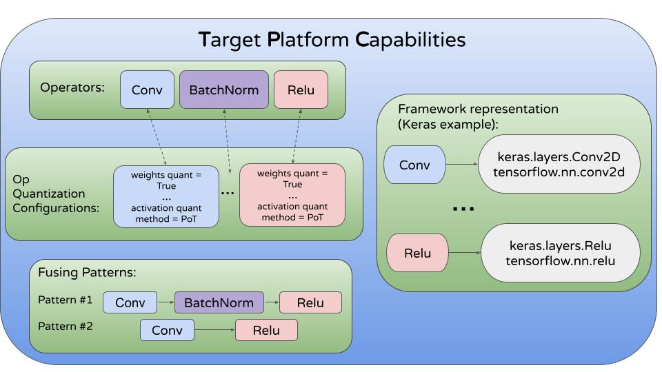

# Target Platform Capabilities (TPC)

## About 

TPC is our way to describe the
hardware that will be used to run and infer with models that are
optimized using the MCT.

The TPC includes different parameters that are relevant to the
 hardware during inference (e.g., number of bits that are used
in some operator for its weights/activations, fusing patterns, etc.)

TPC main components:



## Supported Target Platform Models 

Currently, there are three models in MCT that can be used
(new models can be created and used by users as demonstrated [here](https://sony.github.io/model_optimization/api/experimental_api_docs/modules/target_platform.html#targetplatformmodel-code-example)):
- Default model
- [TFLite](https://www.tensorflow.org/lite/performance/quantization_spec)
- [QNNPACK](https://github.com/pytorch/QNNPACK)

The default model quantizes operators using 8 bits with power-of-two thresholds.
For mixed-precision quantization it uses either 2, 4 or 8 bits for quantizing the operators.
The full default model and its parameters can be viewed [here](https://github.com/sony/model_optimization/blob/main/model_compression_toolkit/core/tpc_models/default_tpc/v3/tp_model.py).

[TFLite](https://github.com/sony/model_optimization/blob/main/model_compression_toolkit/core/tpc_models/tflite_tpc/v1/tp_model.py) and [QNNPACK](https://github.com/sony/model_optimization/blob/main/model_compression_toolkit/core/tpc_models/qnnpack_tpc/v1/tp_model.py) models were created similarly and were used to create two TPCs: One for Keras TPC and one for PyTorch TPC (for each model, this 6 in total).

## Usage

The simplest way to initiate a TPC and use it in MCT is by using the function [get_target_platform_capabilities](https://sony.github.io/model_optimization/api/experimental_api_docs/methods/get_target_platform_capabilities.html#ug-get-target-platform-capabilities).

For example:
```python
from tensorflow.keras.applications.mobilenet import MobileNet
import model_compression_toolkit as mct
import numpy as np

# Get a TargetPlatformModel object that models the hardware for the quantized model inference.
# The model determines the quantization methods to use during the MCT optimization process.
# Here, for example, we use the default target platform model that is attached to a Tensorflow
# layers representation.
target_platform_cap = mct.get_target_platform_capabilities('tensorflow', 'default')

quantized_model, quantization_info = mct.keras_post_training_quantization_experimental(MobileNet(),
                                                                                       lambda: np.random.randn(1, 224, 224, 3),  # Random representative dataset 
                                                                                       target_platform_capabilities=target_platform_cap)
```

Similarly, TFLite and QNNPACK models can be retrieved for Keras and PyTorch frameworks.

For more information and examples, we highly recommend you to visit our [project website](https://sony.github.io/model_optimization/api/experimental_api_docs/modules/target_platform.html#ug-target-platform).

